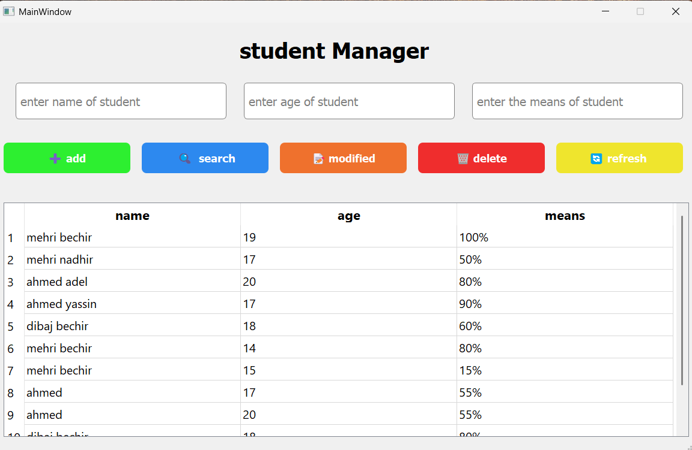

# 📚 Student Manager (PyQt5)

A desktop application built with **Python + PyQt5** to manage student records (Add, Modify, Delete, Search, Refresh).

---

## 🚀 Features

- Add new students
- Modify existing student data
- Delete students
- Search by name
- Refresh table data from file
- Save data using Pickle (binary file)

---

## 🛠️ Technologies Used

- Python
- PyQt5 (GUI)
- Pickle (File handling)

---

## 🖥️ How to Run

1. Install Python (if not installed)

2. Install required library:

```bash
pip install PyQt5
```

3.Run the project:

- python main.py

---

## 📸 Screenshot



---

## 🎥 Demo Video (YouTube)

-Watch the full demo here:

- https://youtu.be/5ljdyFbv-d4
